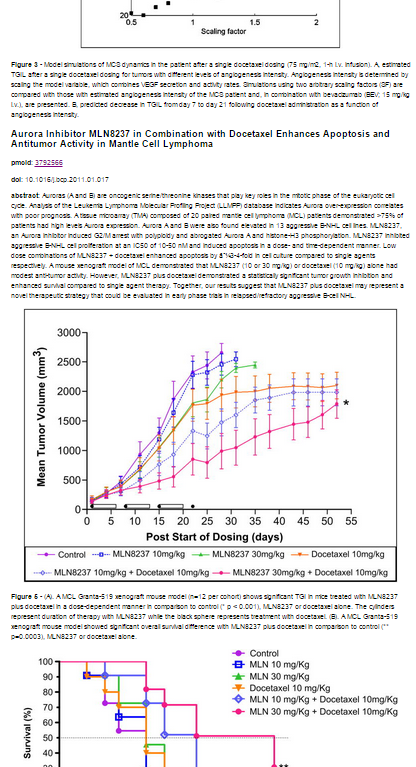

******************************
[Introduction][]

[Required scripts and packages][]

[Database for storing web scraping results][]

[Perform web scraping with pubmedcentral_scraper.R][]

[Visualize web scraping results with markdown_and_plot.R][]

[Custom manipulation of the SQLite database][]

[Possible improvements to the scraper][]

******************************

## Introduction
The purpose of this webscraper is to collect metadata for images (specifically, images of a particular plot-type) in academic articles of a particular drug.

The user supplies search terms: (1) image description, e.g. "TGI", (2) drug/topic, e.g. "Docetaxel".  

The search terms are used to query the [Pubmed Central](http://www.ncbi.nlm.nih.gov/pmc/) database, and articles returned by the query are then scraped. Results of the web scraping are stored in a SQLite database.

Accompanying scripts are provided to query the SQLite database for a particular drug and plot-type and generate html reports displaying links to the source .

A script is also provided to create the required SQLite database if it is not already existing.


******************************

## Required scripts and packages

### Web scraping
The script `pubmedcentral_scraper.R` handles the webscraping.  The following files should be located in the same directory:

* `eSearch.R`
* `eFetch.R`
* `scrapeArticle.R`

In addition, the script needs a SQLite database, e.g. `myDb.sqlite`, for storing the scraped web results.


### Visualizing scraped results
The script `markdown_and_plot.R` is used to visualize the scraped results.  The following files should be located in the same directory:

* `generate_markdown_code.R` 
* `myDb.sqlite` (SQLite database containing the scraped results)


### R package dependencies
The following R packages should be installed:

* `RSQLite`
* `DBI`
* `RCurl`
* `XML`
* `httr`
* `rvest`
* `stringr`
* `knitr`


******************************

## Database for storing web scraping results
A SQLite database is used for storing the results of the web scraping and must be set up before commencing web scraping.  The database is completely self-contained and can be easily transferred between users.

The database consists of three tables: article, figure, and figure_text.  The tables are composed of the following fields:

table: **article**
```
pmcid | doi | title | journal | year | authors | abstract | keywords
```

table: **figure**
```
topic | plot_type | img_url | pmcid
```

table: **figure_text**
```
img_url | fig_name | caption
```

Use the script `createSQLiteDatabase.R` to create a new database with the above schema.  In `createSQLiteDatabase.R`, specify the name, e.g. "myDb.sqlite" of the database in the following line:
```
con = dbConnect(SQLite(), dbname = "myDb.sqlite")
```
Then, run the script to create the database:
```
source("createSQLiteDatabase.R")
```

******************************

## Perform web scraping with pubmedcentral_scraper.R

### Overview
The script `pubmedcentral_scraper.R` queries the PMC database through the Entrez Programming Utilities interface for articles matching user-supplied topic and plot types. Matches are returned in the form of PMCIDs.  

To prevent redundant scraping, the script filters out PMCIDs that already exist in the SQLite database that match the specified topic and plot type.  Note, one article can possibly contain information for multiple topics or multiple plot types, e.g. a TGI plot in an article can contain TGI curves for multiple drugs.

The scraper then goes to the online full text articles corresponding to the remaining PMCIDs and searches every figure caption for keyword matches.  

The metadata for matches are stored in a SQLite database.  Metadata includes both general article information (e.g. Pubmed Central ID (PMCID), journal, title, year) and figure-specific information (e.g. caption and image URL).


### User input for web scraping
At the top of `pubmedcentral_scraper.R` is a section for user input.  Six inputs are required of the user.

1. **database.name**: the name of the database where scraper results are stored
2. **retmax**: the maximum number of results to retrieve from a query
3. **query.topic**: topic terms (keywords) to be queried via the PMC search engine (must contain at least one element)
4. **topic**: the label for the topic in the SQLite database
5. **query.plottype**: keywords to identify the plot type to be captured in the web scraping (must contain at least one element)
6. **plot_type**: the label for the plot type in the SQLite database

For example, in the code chunk below, we scrape a maximum of 10 article IDs from the query.  Any figures that match the search criteria are stored in the SQLite database, `myDb.sqlite`, and identified in the *topic* field by `Docetaxel` (case-sensitive) and *plot_type* field `TGI`.

```
## <---------USER INPUT STARTS HERE--------->

## name of database where scraper results are stored
database.name = "myDb.sqlite"

## maximum number of results to retrieve from query
retmax = 10

## topic terms to be queried via the pubmed search engine
query.topic = c("Docetaxel", "Docetaxol")

## topic/drug label for database
topic = "Docetaxel"

## keywords to identify plot type to be captured
## terms should be lower-case
query.plottype = c("tumor growth", "tumor volume",
                   "tumor size", "tumor inhibition",
                   "tumor growth inhibition", "tgi",
                   "tumor response", "tumor regression")

## plot type label for database
plot_type = "TGI"

## <---------USER INPUT ENDS HERE----------->
```
The topic keywords and plot type keywords are supplied as two separate vectors, `query.topic` and `query.plottype`, respectively.  The lengths of these vectors must be greater than or equal to one.  Candidate matches should match one or more elements of each vector, i.e. the query terms are strung together in the following manner:

```
"(\"Docetaxel\"+OR+\"Docetaxol\")+AND+(\"tumor+growth\"+OR+\"tumor+volume\"+OR+\"tumor+size\"+OR+\"tumor+inhibition\"+OR+\"tumor+growth+inhibition\"+OR+\"tgi\"+OR+\"tumor+response\"+OR+\"tumor+regression\")"
```

Having set the user input parameters, run the web scraper:
```
source("pubmedcentral_scraper.R")
```

Metadata on any figures matching the search are stored in the SQLite database, along with the search criteria associated with the particular figure in the *figure* table of the database.  

For example, a figure located at http://madeupfigurelocation.jpg with pmcid 1234 that matches the above search criteria would contain the following entry in the *figure* table:
```{r, warning=FALSE, echo=FALSE}
library("knitr")
kable(data.frame(topic = "Docetaxel", plot_type = "TGI", img_url = "http://madeupfigurelocation.jpg", pmcid = 1234))
```


**It is important to be consistent with the naming convention for the topic labels in the database for ease of access later.**  For example, if the same query is performed again, but the user changes the entry for the *topic* field from `Docetaxel` to `Docetaxol`, then accessing and plotting all entries from the database that match the Docetaxel/Docetaxol topic is complicated by the need to generate separate html reports for entries whose `topic` field matches `Docetaxel` and `Docetaxol`, at least within the constraints of the `markdown_and_plot.R` script discussed in the next section.

`pubmedcentral_scraper.R` carries out the literature search and stores results in a database, but does not produce any plots.  The next section discusses how to plot the results in the database.

******************************

## Visualize web scraping results with markdown_and_plot.R

### Overview
The script `markdown_and_plot.R` allows the user to visualize entries stored in the database for a particular topic and plot type, whether freshly scraped in the same R session or generated from a previous scraping session, e.g. all TGI plots found for Docetaxel.

The script retrieves the metadata for images that are labeled by the user-specified topic and plot type, along with metadata for the article.  Markdown code (formatting language for generating html content) is dynamically generated, and images are embedded via href links to the image URLs.  Note that the images themselves are not saved during web scraping, but rather their URLs.

The markdown code is then knitted into a finished html file and output in the same directory as `markdown_and_plot.R`.  


### User input for plotting
At the top of `markdown_and_plot.R` is a section for user input.  Four input settings are specified by the user.

1. **db**: the name of the database where scraper results are stored
2. **topic**: the topic/drug label of interest
3. **plot_type**: the plot type label
4. **md.filename**: the filename of the output markdown code

For example, in the code chunk below, all entries corresponding to the topic "Docetaxel" and plot_type "TGI" are retrieved from the "myDb.sqlite" database.  An intermediate file, "makeHTMLplots.rmd" is generated and can be (optionally) deleted after the html file is produced.  The name of the generated html file is `scraper_TGI_plots_for_Docetaxel.html`.

```
## <---------USER INPUT STARTS HERE--------->

## name of database where scraper results are stored
db = "myDb.sqlite"

## topic/drug label for database
topic = "Docetaxel"

## plot type label for database
plot_type = "TGI"

## filename of generated markdown code
md.filename = "makeHTMLplots.rmd"

## <---------USER INPUT ENDS HERE----------->
```

Having set the user input parameters, generate html report for scraper results
```
source("markdown_and_plot.R")
```

The output html file is divided into one section per article.  Each section is organized in the following format:
```
Title of paper
pmcid/link to paper on PMC
doi
abstract

figure A
caption for figure A

figure B
caption for figure B

.
.
.


```

The image below is an excerpt of the report generated for *topic* = Docetaxel, *plot_type* = TGI.



******************************

## Custom manipulation of the SQLite database

SQL (structured query language) commands via the `RSQLite` package are necessary if you want to view or manipulate the database outside of `pubmedcentral_scraper.R` and `markdown_and_plot.R`.  In this section, we provide examples of some common usage cases.  Free software is also available, e.g. [SQLiteStudio](http://sqlitestudio.pl/), access to the database via a GUI is preferred. 

References for SQL commands are also freely available [online](http://www.w3schools.com/sql).

### Example 1: Connect and disconnect from a database
We can connect and disconnect to the database "myDb.sqlite" using the R packages `DBI` and `RSQLite`:
```{r, warning=FALSE}
library(DBI)
library(RSQLite)

## Connect to the database
con = dbConnect(SQLite(), dbname = "myDb.sqlite")

## Disconnect from database
dbDisconnect(con)
```
The function `dbDisconnect()` returns `TRUE` upon successfully disconnecting from the table.


### Example 2: List all the tables in the database
```{r, warning=FALSE}
con = dbConnect(SQLite(), dbname = "myDb.sqlite")
dbListTables(con)
dbDisconnect(con)
```


### Example 3: List all the fields in the "article" table
```{r, warning=FALSE}
con = dbConnect(SQLite(), dbname = "myDb.sqlite")
dbListFields(con, "figure")
dbDisconnect(con)
```


### Example 4: Select all entries in the table "figure" matching the "Docetaxel" topic and "TGI" plot type
The retrieved entries are stored in the variable `images`:
```{r}
con = dbConnect(SQLite(), dbname = "myDb.sqlite")
query = 'SELECT *\
         FROM figure\
         WHERE (topic = "Docetaxel" AND plot_type = "TGI")'
images = dbGetQuery(con, query)
dbDisconnect(con)
```

How many entries were retrieved?
```{r}
nrow(images)
```

Take a look at the first few entries
```{r}
kable(head(images))
```

### Example 5: What are the distinct/unique topics stored in the database?
```{r}
con = dbConnect(SQLite(), dbname = "myDb.sqlite")
query = 'SELECT DISTINCT topic\
         FROM figure'
topics = dbGetQuery(con, query)
dbDisconnect(con)

topics
```

### Example 6: Count how many figures are associated with the topic "Paclitaxel"
```{r}
con = dbConnect(SQLite(), dbname = "myDb.sqlite")
query = 'SELECT COUNT(topic)\
         FROM figure\
         WHERE topic=\"Paclitaxel\"'
counts = dbGetQuery(con, query)
dbDisconnect(con)

counts
```

******************************

## Possible improvements to the scraper

When evaluating whether an article should be scraped, `pubmedcentral_scraper.R` currently only checks if the set of {PMCID, topic, plot_type} already exist in the SQLite database, thereby eliminating one possibility for redundant scraping.  

However, there exists another route for redundant scraping; no record is kept in the database of articles that were previously scraped but yielded no images.  Therefore, if the exact same search is performed again, such articles will be scraped and, again, discarded.  

To eliminate this second source of redundant scraping, another table, *no_hit_scrapes*, can be added to the SQLite database containing the fields {pmcid, topic_terms, plot_terms}, where *topic_terms* and *plot_terms* would be strings of alternatives provided for the query for the topic and plot_type, respectively, that yielded no matches during the scrape of an article with a particular pmcid.

The extra processing due to this check, e.g. from splitting strings in *topic_terms* and *plot_terms* and then comparing sets of strings, would offset gains in efficiency from eliminating the scraping redundancy.  In particular, for small-scale scrapes (for which these scripts are intended), such extra processing/checking is probably a low priority.


******************************